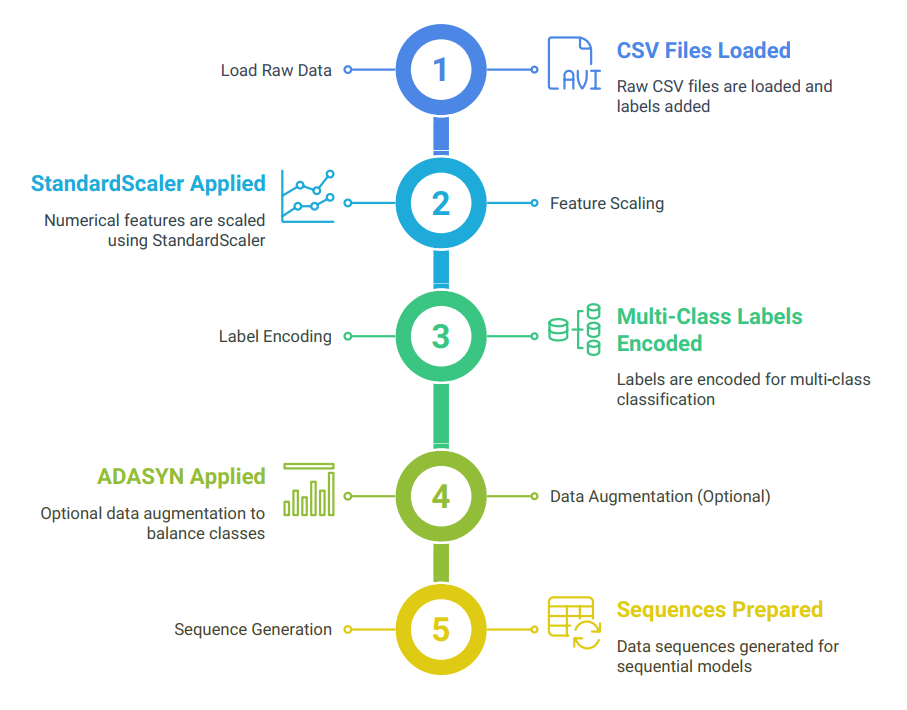
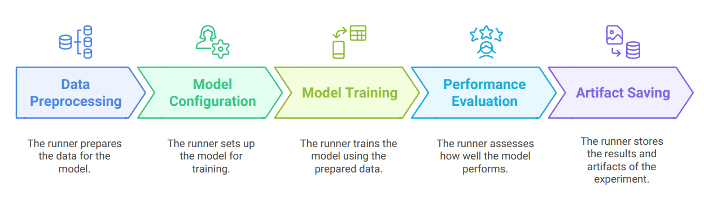

# Network Traffic Classification with Deep Learning Models

This project implements and compares multiple deep learning architectures for network traffic classification, focusing on detection and classification of various cyber attacks in network traffic data. It includes four different models:

- LSTM
- Transformer
- CNN-Transformer (Hybrid)
- TabTransformer (FTTransformer)

The project provides end-to-end pipelines for data loading, preprocessing, model training, evaluation, and artifact management.

## Table of Contents

- [Network Traffic Classification with Deep Learning Models](#network-traffic-classification-with-deep-learning-models)
  - [Table of Contents](#table-of-contents)
  - [Quickstart](#quickstart)
  - [Project Structure](#project-structure)
  - [Dataset](#dataset)
  - [Setup and Installation](#setup-and-installation)
    - [Prerequisites](#prerequisites)
    - [Installation](#installation)
  - [Running Experiments](#running-experiments)
    - [Example Usage LSTM model with console output:](#example-usage-lstm-model-with-console-output)
    - [Experiment Parameters](#experiment-parameters)
  - [Configuration](#configuration)
  - [Artifacts \& Logging](#artifacts--logging)
  - [Model Evaluation](#model-evaluation)
  - [Exploring the Dataset](#exploring-the-dataset)
  - [Data Preprocessing](#data-preprocessing)
  - [Experiment Runners](#experiment-runners)


## Quickstart

Clone, install, and run a sample experiment in one line:

```bash
git clone https://github.com/ichrakhamdi/DeepLearningProject.git && cd DeepLearningProject
python main.py --model CNNTransformer
```

## Project Structure

```
/DeepLearningProject
├── main.py                  # Entry point to run experiments
├── README.md                # This file
├── requirements.txt         # Project dependencies
├── utils.py                 # Utility functions (e.g., sample_per_class)
│
├── artifacts/               # Output directory for all model artifacts
│   ├── CNNTransformer/
│   ├── LSTM/
│   ├── TFTransformer/
│   └── Transformer/
│
├── config/                  # Configuration for each model
│   ├── general_settings.py
│   ├── LSTM_settings.py
│   ├── Transformer_settings.py
│   ├── TFTransformer_settings.py
│   └── CNNTransformer_settings.py
│
├── data/                    # Data pipeline
│   ├── code/                # Loader and preparation scripts
│   │   ├── loader.py        # CICIDataLoader: raw CSV ➔ concatenated labels
│   │   ├── preprocessor.py  # DataPreprocessor: scaling, encoding, augmentation
│   │   └── prepare_datasets.py
│   └── concatenated/        # Output: train.csv & test.csv
│
├── experiments_runners/     # Classes orchestrating experiment runs
│   ├── LSTMExperimentRunner.py
│   ├── TransformerExperimentRunner.py
│   ├── TFTransformerExperimentRunner.py
│   └── CNNTransformerExperimentRunner.py
│
├── models/                  # Model definitions & trainers
│   ├── lstm/
│   ├── transformer/
│   ├── TFTransformer/
│   └── cnn_transformer/
│
└── notebooks/               # Jupyter notebooks for exploration
        └── explore_datasets.ipynb
```

## Dataset

The project uses network traffic data with the following features:

- **Features (18)**: Header_Length, Protocol Type, Duration, Rate, Srate, Drate, fin_flag_number, syn_flag_number, rst_flag_number, psh_flag_number, Std, IAT, Number, Magnitue, Radius, Covariance, Variance, Weight

- **Labels**:
    - Binary classification (label_2): BENIGN vs ATTACK
    - 6-class classification (label_6): BENIGN, SPOOFING, RECON, MQTT, DoS, DDoS
    - 19-class classification (label_19): Detailed attack types

## Setup and Installation

### Prerequisites

- Python 3.8+
- TensorFlow 2.x
- CUDA-compatible GPU (recommended)

### Installation

1. Clone the repository:
     ```bash
     git clone https://github.com/ichrakhamdi/DeepLearningProject.git
     cd DeepLearningProject
     ```

2. **Optional:** Create and activate a virtual environment:

     ```bash
     python -m venv venv
     source venv/bin/activate      # macOS/Linux
     venv\\Scripts\\activate      # Windows
     ```

3. Install dependencies:
     ```bash
     pip install -r requirements.txt
     ```

4. Prepare the dataset:

     Raw CSV files should be placed under:

     * `data/raw/train/`
     * `data/raw/test/`

     To load, label, and concatenate:

     ```bash
     python data/code/prepare_datasets.py
     ```

     This generates:

     * `data/concatenated/train.csv`
     * `data/concatenated/test.csv`

## Running Experiments

The main script takes a model name as input and runs all the experiment combinations for that model:

```bash
python main.py --model MODEL_NAME
```

Where `MODEL_NAME` can be one of:
- `LSTM` - LSTM-based sequence classifier
- `Transformer` - Pure transformer architecture
- `CNNTransformer` - CNN + Transformer hybrid
- `TabTransformer` - FTTransformer for tabular data

### Example Usage LSTM model with console output:

```bash
$ python main.py --model CNNTransformer
model selected: CNNTransformer
=== Running experiment: 6class_augTrue_cwFalse ===
Epoch 1/20
...
Saved confusion matrix to artifacts/CNNTransformer/results/6class_augTrue_cwFalse_cm.csv
=== All experiments completed successfully ===
```

### Experiment Parameters

For each model, the following parameter combinations are tested:

- **Classification Types**: Binary (2-class), 6-class, and 19-class
- **Data Augmentation**: With and without ADASYN oversampling
- **Class Weights**: With and without class weight balancing

## Configuration

Adjust model-specific hyperparameters in the `config/` directory:

* `general_settings.py`         – shared settings (features, paths, defaults)
* `LSTM_settings.py`            – LSTM-specific parameters
* `Transformer_settings.py`     – Transformer-specific parameters
* `TFTransformer_settings.py`   – TabTransformer-specific parameters
* `CNNTransformer_settings.py`  – CNNTransformer-specific parameters

Edit values such as `EPOCHS`, `BATCH_SIZE`, or learning rates as needed.

## Artifacts & Logging

By default, all outputs are organized under `artifacts/<ModelName>/` for each model, and `logs/` for logs. The structure is as follows:

```
artifacts/
├── <ModelName>/
│   ├── models/      # Saved model weights and checkpoints (.h5)
│   ├── scalers/     # StandardScaler objects (.joblib)
│   ├── encoders/    # LabelEncoder objects (.joblib)
│   ├── plots/       # Training curves & confusion matrices (.png)
│   └── results/     # CSV reports & experiment_summary.csv
└── logs/            # Training logs with timestamps for all models
```

## Model Evaluation

Models are evaluated on:
- Accuracy
- Macro F1-score
- Weighted F1-score
- Confusion matrices

## Exploring the Dataset

- **`notebooks/explore_datasets.ipynb`**: A Jupyter notebook to:
    - Load and print data shapes.
    - Display tables of feature distributions.
    - Plot class distributions and feature correlations.


## Data Preprocessing

The data preprocessing pipeline includes the following steps:




## Experiment Runners

Each model has a dedicated experiment runner class that orchestrates the entire experiment process. These runners (located in the `experiments_runners/` directory) handle the following tasks:


